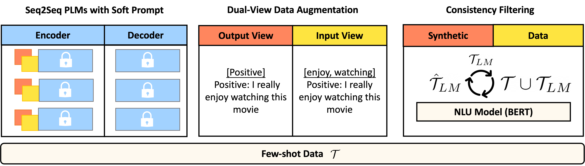
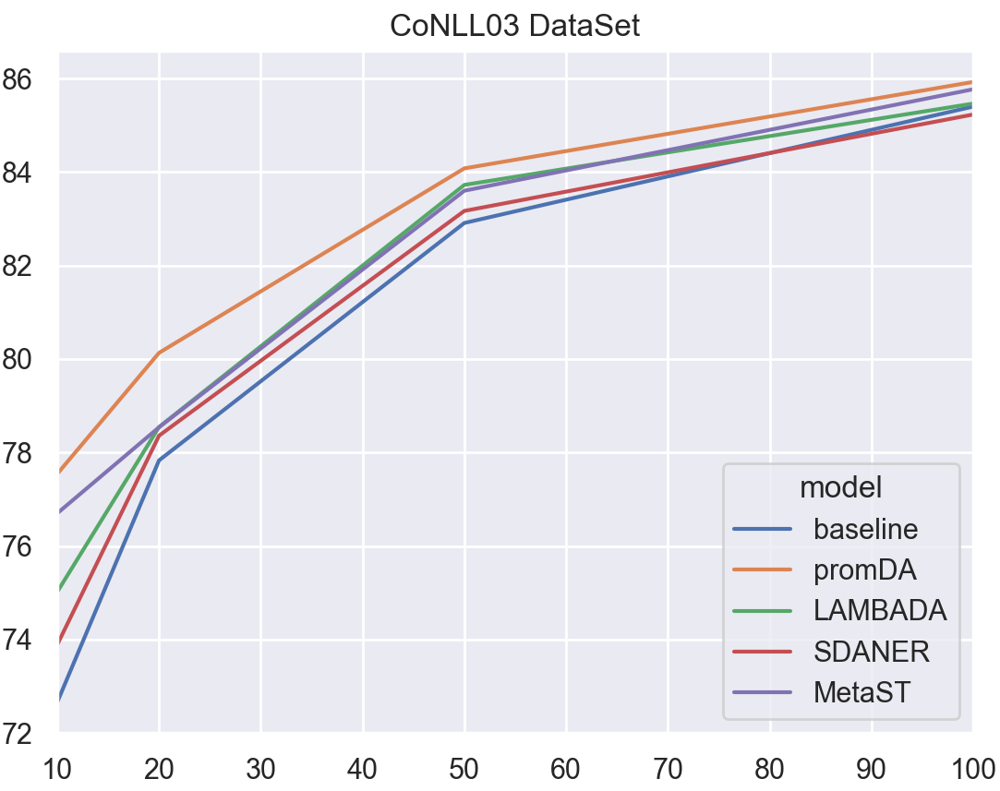
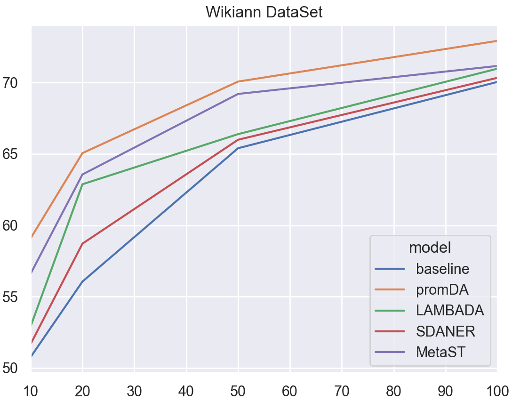
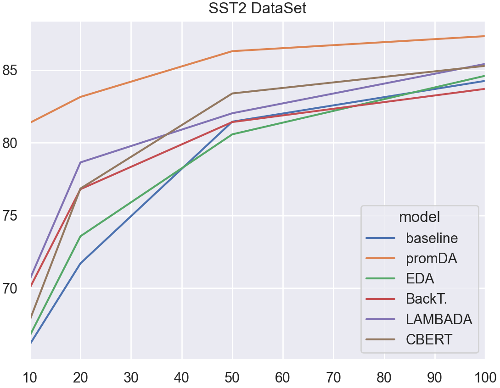
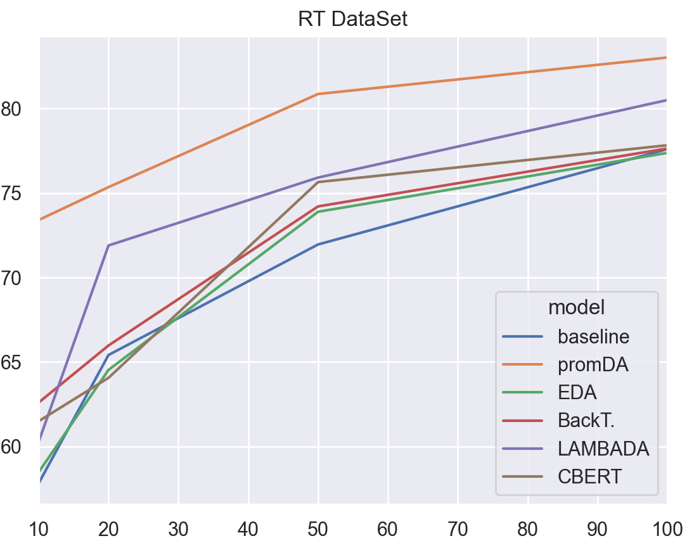

# Prompt-based Data Augmentation for Low-Resource NLU Tasks

This repository is the official implementation of [PromDA: Prompt-based Data Augmentation for Low-Resource NLU Tasks](https://arxiv.org/abs/2202.12499). 



## Requirements

To install requirements:

```setup
conda create --name exp --file requirements.txt
```

## Pre-training Soft Prompt
To obtain C4 `realnewslike` split, please run:
```python
python get_large_pre_training_c4_data.py
```

We need to do the Prompt Pre-training, please run:
```python
python pre_train_t5.py --config model_config/pre_train_keyword_pt.yml --serialization-dir pretrain_web_page_keyword_t5_short --train
```
In a Nvidia A100 GPU, this takes about 24 hours to complete.

## Run PromDA

To run the full data augmentation experiments, please follow below instructuins:
# Sequence Labelling Tasks
To run the wikiann experiments on the first GPU under the shot-10 setting, please run
```bash
bash script/run_few_shot_bert_prefix.sh 0 10 wikiann 1000
```
# Sentence Classification Tasks
To run the sst2 experiments on the first GPU under the shot-10 setting, please run
```bash
bash script/run_few_shot_bert_prefix_sen_cls.sh 0 10 sst2 1000
```

## Result

   
